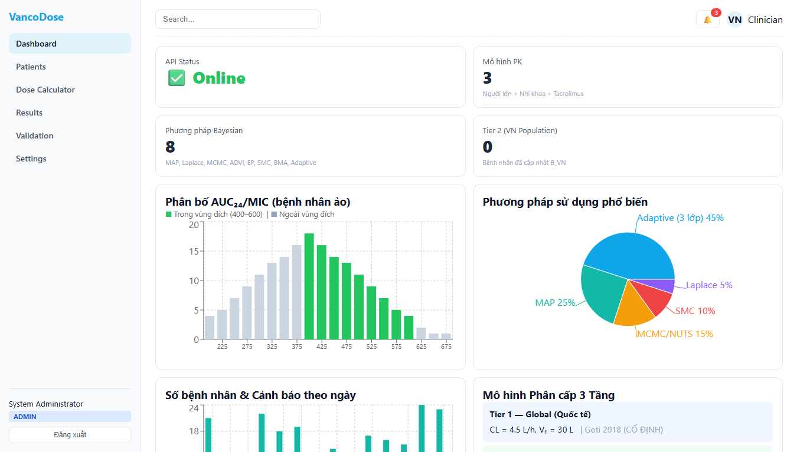
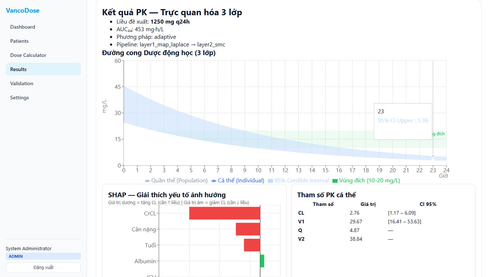
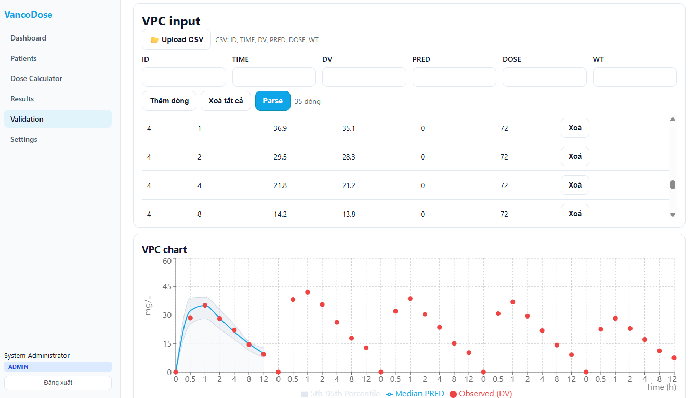
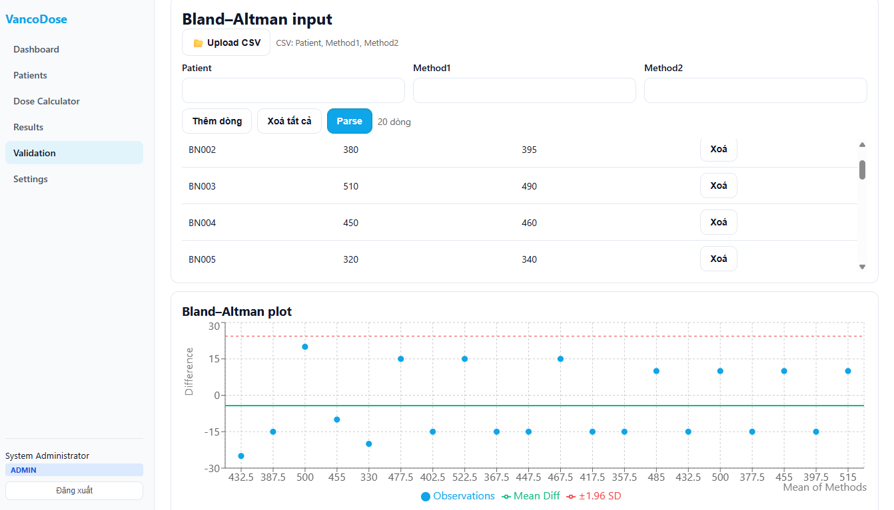
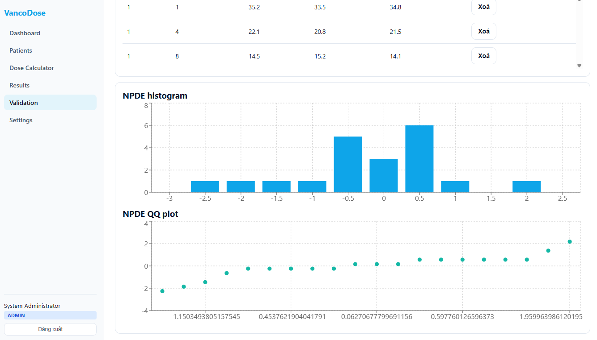

# MIPD – Model-Informed Precision Dosing

**Hệ thống tối ưu liều lượng thuốc dựa trên Pharmacokinetics/Pharmacodynamics (PK/PD) cho bệnh viện Việt Nam.**

## 📸 Screenshots

| Dashboard | Results (PK Curve 3 lớp) |
|:-:|:-:|
|  |  |

| VPC Chart | Bland-Altman Plot | NPDE Histogram + QQ |
|:-:|:-:|:-:|
|  |  |  |

## 🎯 Mục tiêu

Xây dựng hệ thống MIPD hỗ trợ dược sĩ lâm sàng tối ưu liều vancomycin:
- 🧬 Mô hình PK dân số (Population PK) – 2-compartment IV
- 📊 Bayesian estimation cá thể hóa (MAP, Laplace, ADVI, EP, SMC, MCMC, Adaptive Pipeline)
- 💊 Tối ưu liều AUC₂₄/MIC-guided với Monte Carlo PTA
- 🛡️ Hệ thống an toàn 5 lớp bảo vệ bệnh nhân
- 🤖 AI/ML: phát hiện bất thường TDM, sàng lọc covariate
- ✅ Thẩm định mô hình (MPE, MAPE, CCC, NPDE, VPC, Bland-Altman)

## 🏗️ Kiến trúc hệ thống

```
Frontend (:5173)  →  API Gateway (:5000)  →  PK Engine (:8000)
   React/Vite          ASP.NET + YARP          Python/FastAPI
                        JWT Auth
                        RBAC 4 roles
                        Audit Trail
```

### Cấu trúc thư mục

```
MIPD/
├── src/
│   ├── frontend/                    # React SPA (Vite)
│   │   ├── src/
│   │   │   ├── pages/
│   │   │   │   ├── Dashboard.jsx    # Tổng quan + API health check
│   │   │   │   ├── Dosing.jsx       # Dose Calculator → Bayesian API
│   │   │   │   ├── Results.jsx      # PK curve 3 lớp + SHAP + params
│   │   │   │   ├── Validation.jsx   # VPC, Bland-Altman, NPDE + CSV upload
│   │   │   │   ├── Patients.jsx     # Quản lý bệnh nhân
│   │   │   │   ├── Settings.jsx     # Cài đặt hệ thống
│   │   │   │   └── Login.jsx        # Đăng nhập JWT
│   │   │   ├── auth/AuthContext.jsx  # JWT context + protected routes
│   │   │   ├── api/client.js        # API client (auto JWT injection)
│   │   │   └── styles.css           # Design system
│   │   ├── sample_data/             # CSV mẫu cho Validation
│   │   └── vite.config.js           # Proxy → Gateway
│   │
│   ├── backend/MIPD.ApiGateway/     # .NET 8 API Gateway
│   │   ├── Program.cs               # YARP + JWT + CORS + Health
│   │   ├── appsettings.json         # Route config
│   │   ├── Services/
│   │   │   ├── AuthService.cs       # User management + login
│   │   │   ├── JwtService.cs        # JWT token generation
│   │   │   ├── AuditService.cs      # Audit trail logging
│   │   │   └── CacheService.cs      # Redis/InMemory cache
│   │   └── Middleware/
│   │       └── AuditMiddleware.cs    # Request/response auditing
│   │
│   └── pk-engine/                   # Python PK Engine (FastAPI)
│       ├── pk/                      # Core PK models
│       │   ├── models.py            # PatientData, DoseEvent, PKParams
│       │   ├── analytical.py        # Analytical 2-comp solutions
│       │   ├── solver.py            # RK45 ODE solver
│       │   ├── population.py        # Population PK (Vancomycin VN)
│       │   └── clinical.py          # CrCL, eGFR, IBW, ABW
│       ├── bayesian/                # 7 inference methods
│       │   ├── map_estimator.py     # MAP
│       │   ├── laplace.py           # Laplace approximation
│       │   ├── advi.py              # Variational Inference
│       │   ├── ep.py                # Expectation Propagation
│       │   ├── smc.py               # Sequential Monte Carlo
│       │   ├── mcmc.py              # MCMC/NUTS (NumPyro)
│       │   └── engine.py            # Adaptive 3-Layer Pipeline ⭐
│       ├── dosing/optimizer.py      # Dose optimization + PTA
│       ├── ai/                      # AI/ML features
│       │   ├── anomaly_detection.py # Swift Hydra 4-head QC
│       │   ├── ml_screening.py      # RF+NN+SVR covariate screening
│       │   └── gp_bnn.py            # GP + BNN models
│       ├── validation/metrics.py    # MPE, MAPE, RMSE, CCC, NPDE
│       ├── api/                     # FastAPI routes + schemas
│       │   ├── main.py              # App entry + CORS
│       │   ├── schemas.py           # Pydantic models
│       │   ├── safety.py            # 5-layer guardrails
│       │   ├── routes_pk.py         # /pk/*
│       │   ├── routes_bayesian.py   # /bayesian/*
│       │   ├── routes_dosing.py     # /dosing/*
│       │   └── routes_ai.py         # /ai/*
│       └── tests/                   # pytest test suite
│
├── docker/
│   └── init-db.sh                   # Database init script
├── docker-compose.yml               # Multi-service orchestration
├── .github/workflows/ci.yml         # GitHub Actions CI/CD
└── .env.example                     # Environment variables template
```

## 🚀 Quick Start (Demo cục bộ)

### Yêu cầu
- **Python 3.11+** (PK Engine)
- **.NET 8 SDK** (API Gateway)
- **Node.js 18+** (Frontend)

### 1. Clone & khởi tạo

```bash
git clone https://github.com/<your-org>/MIPD.git
cd MIPD
```

### 2. Chạy PK Engine (Terminal 1)

```bash
cd src/pk-engine
python -m venv .venv
.venv\Scripts\activate          # Windows
pip install -r requirements.txt
uvicorn api.main:app --port 8000 --reload
```
→ Swagger UI: http://localhost:8000/docs

### 3. Chạy API Gateway (Terminal 2)

```bash
cd src/backend/MIPD.ApiGateway
dotnet run --urls "http://localhost:5000"
```
→ Gateway: http://localhost:5000 (JSON info)
→ Health: http://localhost:5000/health

### 4. Chạy Frontend (Terminal 3)

```bash
cd src/frontend
npm install
npm run dev
```
→ App: http://localhost:5173

### 5. Đăng nhập

| Email | Mật khẩu | Vai trò |
|-------|----------|---------|
| `admin@mipd.vn` | `admin123` | Admin |
| `dr.nguyen@mipd.vn` | `doctor123` | Physician |
| `ds.tran@mipd.vn` | `pharma123` | Pharmacist |
| `nurse.le@mipd.vn` | `nurse123` | Nurse |

## 📡 API Endpoints

### API Gateway (`:5000`)

| Method | Endpoint | Chức năng |
|--------|----------|-----------|
| POST | `/auth/login` | Đăng nhập → JWT token |
| POST | `/auth/register` | Đăng ký tài khoản |
| GET | `/auth/me` | Thông tin user [Authorized] |
| GET | `/health` | Health check |
| GET | `/audit/recent` | Audit log [Admin] |

### PK Engine (`:8000` qua Gateway `/api/*`)

| Method | Endpoint | Chức năng |
|--------|----------|-----------|
| GET | `/` | PK Engine health |
| GET | `/docs` | Swagger UI |
| POST | `/pk/predict` | Dự đoán nồng độ + AUC |
| POST | `/pk/clinical` | CrCL, eGFR, IBW, ABW |
| POST | `/bayesian/estimate` | Bayesian estimation (7 methods) |
| POST | `/dosing/recommend` | Khuyến nghị liều + PTA |
| POST | `/dosing/cfr` | Cumulative Fraction of Response |
| POST | `/ai/anomaly-check` | Kiểm tra chất lượng TDM |
| POST | `/ai/screen-covariates` | Sàng lọc covariate |
| POST | `/ai/validate-metrics` | MPE, MAPE, RMSE, CCC |

### Routing (Vite → Gateway → PK Engine)

```
Frontend /api/bayesian/estimate
    → Vite proxy    → localhost:5000/api/bayesian/estimate
    → YARP Gateway  → localhost:8000/bayesian/estimate  (strip /api prefix)
```

## 🛡️ Hệ thống An toàn (5 Lớp)

| Lớp | Bảo vệ | Ví dụ |
|-----|--------|-------|
| 1. Input Validation | Chặn dữ liệu vô lý | Weight < 10 kg, Age > 120 |
| 2. PK Plausibility | PK params bất thường | CL = 0.01 L/h |
| 3. Dose Limits | Hard cap liều tối đa | Max 3000 mg vancomycin |
| 4. Confidence Check | Reject CI quá rộng | CI ratio > 3.0 |
| 5. Risk Score | Tổng hợp cảnh báo | 0.0 (safe) → 1.0 (reject) |

## 📊 Validation (CSV Upload)

Trang Validation hỗ trợ upload CSV trực tiếp. File CSV mẫu nằm trong `src/frontend/sample_data/`:

| File | Cột | Mục đích |
|------|-----|----------|
| `vpc_sample.csv` | ID, TIME, DV, PRED, DOSE, WT | Visual Predictive Check |
| `bland_altman_sample.csv` | Patient, Method1, Method2 | Bland-Altman plot |
| `npde_sample.csv` | ID, TIME, DV, PRED, IPRED | NPDE histogram + QQ plot |

## 🐳 Docker Deployment

```bash
# Copy .env
cp .env.example .env

# Build & run all services
docker compose up --build -d

# Check logs
docker compose logs -f
```

## 🧪 Testing

```bash
# PK Engine tests
cd src/pk-engine
python -m pytest tests/ -v

# Specific test suites
python -m pytest tests/test_bayesian.py -v       # Bayesian methods
python -m pytest tests/test_api_safety.py -v      # Safety guardrails
python -m pytest tests/test_validation_ai.py -v   # AI + validation
```

## 📋 Tech Stack

| Component | Technology |
|-----------|-----------|
| Frontend | React 18, Vite 5, Recharts |
| API Gateway | .NET 8, YARP, JWT Bearer |
| PK Engine | Python 3.11, FastAPI, NumPy, SciPy |
| MCMC | JAX, NumPyro (Linux/WSL) |
| AI/ML | scikit-learn, BNN |
| Cache | Redis / InMemory fallback |
| CI/CD | GitHub Actions |
| Container | Docker, docker-compose |

## 👥 Vai trò (RBAC)

| Vai trò | Quyền |
|---------|-------|
| Admin | Full access + audit log |
| Physician | Xem kết quả + ra y lệnh |
| Pharmacist | Dose calculator + validation |
| Nurse | Xem phác đồ điều trị |

## 📄 License

MIT License
