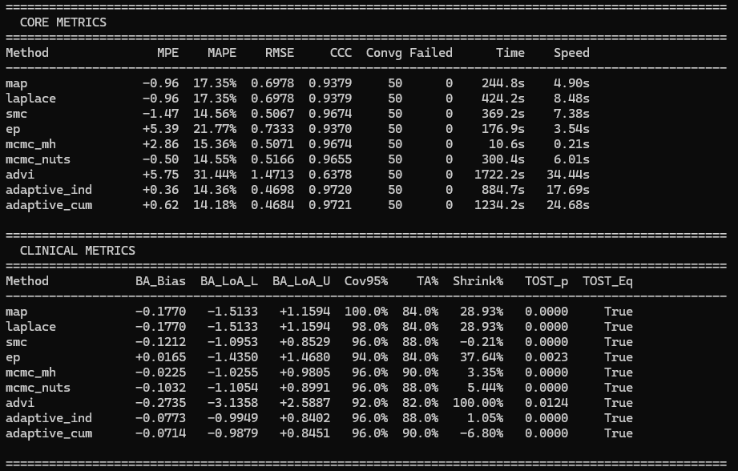
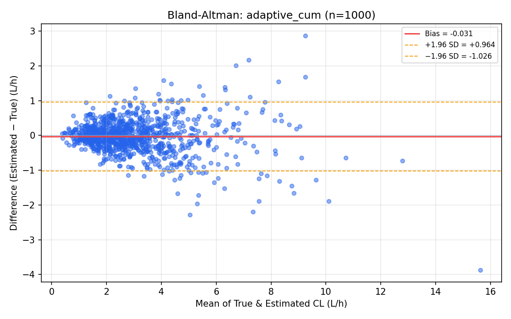
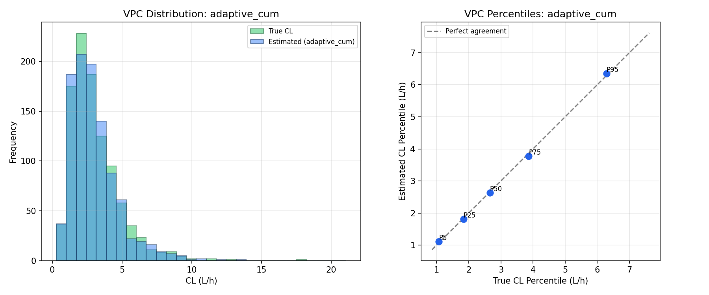
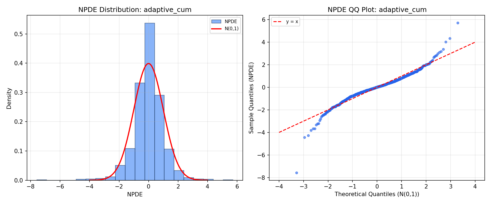

# PK Engine — Bayesian MIPD cho Vancomycin

Công cụ định liều chính xác (Model-Informed Precision Dosing) dựa trên dược động học quần thể và thuật toán Bayesian thích nghi cho bệnh nhân Việt Nam.

## Kiến trúc

```
pk-engine/
├── pk/                     # PK model core
│   ├── models.py           # PKParams, PopPKModel, DoseEvent, Observation
│   ├── solver.py           # ODE/Analytical PK solver
│   ├── population.py       # VANCOMYCIN_VN params (Goti 2018), apply_iiv
│   └── analytical.py       # 2-compartment analytical superposition
├── bayesian/               # Bayesian estimation algorithms
│   ├── engine.py           # Unified engine + adaptive_pipeline()
│   ├── map_estimator.py    # MAP (Maximum A Posteriori)
│   ├── laplace.py          # Laplace Approximation (MAP + Hessian → CI)
│   ├── smc.py              # Sequential Monte Carlo (Particle Filter)
│   ├── ep.py               # Expectation Propagation
│   ├── mcmc_mh.py          # MCMC Metropolis-Hastings (analytical solver)
│   ├── mcmc.py             # MCMC-NUTS (JAX + NumPyro)
│   ├── advi.py             # Automatic Differentiation VI (NumPyro)
│   ├── bma.py              # Bayesian Model Averaging
│   ├── hierarchical.py     # Hierarchical Bayesian (3-tier)
│   └── population_store.py # Vietnam Population Store (SAEM update)
└── benchmarks/             # Benchmark & validation
    ├── run_benchmark.py          # Single-process benchmark
    ├── run_benchmark_parallel.py # Multi-process parallel benchmark
    ├── merge_results.py          # Merge CSV results from parallel runs
    ├── benchmark_plots.py        # Bland-Altman, VPC, NPDE plots
    └── plots/                    # Generated validation plots
```

## Cài đặt

```bash
cd src/pk-engine
pip install -r requirements.txt
```

Yêu cầu: Python 3.11+, NumPy, SciPy, JAX, NumPyro, matplotlib

---

## Hướng dẫn chạy Benchmark

### Bước 1: Chạy benchmark (chọn 1 trong 2 cách)

**Cách A — Chạy đơn (1 CMD, đơn giản)**

```bash
cd src/pk-engine
python benchmarks/run_benchmark.py --n 50 --methods map,laplace,smc,ep,mcmc_mh,mcmc_nuts,advi,adaptive_ind,adaptive_cum
```

**Cách B — Chạy song song (2 CMD, nhanh hơn, khuyến nghị)**

Mở **CMD 1** — Các method nhanh:
```bash
cd src/pk-engine
python benchmarks/run_benchmark_parallel.py --methods map,laplace,smc,ep,mcmc_mh --n 50 --workers 3
```

Mở **CMD 2** — Các method nặng + adaptive:
```bash
cd src/pk-engine
python benchmarks/run_benchmark_parallel.py --methods mcmc_nuts,advi,adaptive_ind,adaptive_cum --n 50 --workers 3
```

### Bước 2: Merge kết quả (nếu chạy Cách B)

Sau khi cả 2 CMD chạy xong, merge CSV:

```bash
cd src/pk-engine
python benchmarks/merge_results.py "benchmarks/results_CMD1_*.csv" "benchmarks/results_CMD2_*.csv"
```

### Bước 3: Xem kết quả

Kết quả xuất ra:
- **`benchmark_results_merged.csv`** — Bảng Core + Clinical metrics đầy đủ
- **`benchmarks/plots/`** — 27 plots (3 loại × 9 methods)

---

## Kết quả Benchmark (N=50 bệnh nhân ảo, Goti 2018)

### Core Metrics & Clinical Metrics



| Method | Tốc độ | CCC | MAPE | TA% | Mô tả |
|:--|:--|:--|:--|:--|:--|
| `map` | 4.9s/BN | 0.938 | 17.35% | 84% | Maximum A Posteriori — tiêu chuẩn FDA |
| `laplace` | 8.5s/BN | 0.938 | 17.35% | 84% | MAP + Hessian → CI 95% |
| `smc` | 7.4s/BN | 0.967 | 14.56% | 88% | Sequential Monte Carlo (500 particles) |
| `ep` | 3.5s/BN | 0.937 | 21.77% | 84% | Expectation Propagation |
| `mcmc_mh` | **0.2s/BN** | 0.967 | 15.36% | 90% | Metropolis-Hastings (analytical solver) |
| `mcmc_nuts` | 6.0s/BN | 0.966 | 14.55% | 88% | NUTS — gold standard MCMC (JAX) |
| `advi` | 34.4s/BN | 0.638 | 31.44% | 82% | Variational Inference (đang cải thiện) |
| `adaptive_ind` | 17.7s/BN | **0.972** | 14.36% | 88% | Pipeline MAP→SMC (reset mỗi BN) |
| `adaptive_cum` | 24.7s/BN | **0.972** | **14.18%** | **90%** | Pipeline MAP→SMC + Population Store |

> **Phương pháp tốt nhất:** `adaptive_cum` — CCC=0.972, MAPE=14.18%, TA=90%, BA Bias=−0.071

---

## Validation Plots

### Bland-Altman — adaptive_cum (phương pháp tốt nhất)



### VPC (Visual Predictive Check) — adaptive_cum



### NPDE (Normalized Prediction Distribution Errors) — adaptive_cum



> Tất cả 27 plots (3 loại × 9 methods) nằm tại `benchmarks/plots/`

---

## Metrics đầu ra

### Core Metrics
- **MPE** — Mean Prediction Error (bias), ngưỡng: |MPE| < 15%
- **MAPE** — Mean Absolute Prediction Error (precision), ngưỡng: < 20%
- **RMSE** — Root Mean Squared Error, ngưỡng: < 1.0 L/h
- **CCC** — Concordance Correlation Coefficient, ngưỡng: > 0.85

### Clinical Metrics
- **BA Bias / LoA** — Bland-Altman analysis
- **Cov95%** — Coverage xác suất 95% (80–100%)
- **TA%** — Target Attainment AUC 400–600 mg·h/L (> 80%)
- **Shrink%** — η-Shrinkage (< 30%)
- **TOST** — Two One-Sided Tests tương đương (p < 0.05)

### Plots
- `bland_altman_{method}.png` — Bias ± Limits of Agreement
- `vpc_{method}.png` — Visual Predictive Check
- `npde_{method}.png` — Normalized Prediction Distribution Errors

---

## Tải lại bệnh nhân đã lưu (reproducible)

```bash
# Lần đầu: tự động lưu patients_50.pkl
python benchmarks/run_benchmark_parallel.py --methods map --n 50

# Lần sau: load lại cùng bộ BN
python benchmarks/run_benchmark_parallel.py --methods smc --n 50 --load-patients patients_50.pkl
```

---

## Tham khảo chính

- Goti et al. (2018), *Clin Pharmacokinet* 57(6):735–748
- Rybak et al. (2020), *AJHP* 77(11):835–864 (IDSA/ASHP Guidelines)
- Hien et al. (2021), *Kidney Int Rep* — CKD prevalence VN
- Broeker et al. (2019), *CPT:PSP* 8(6) — Validation framework
